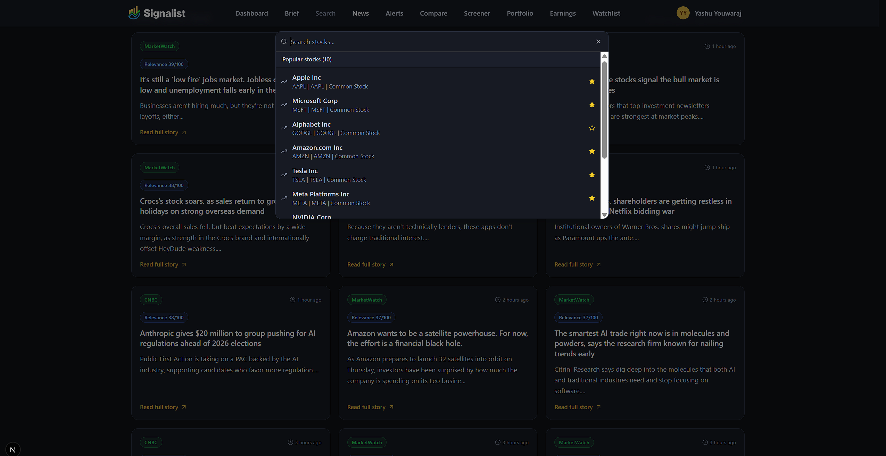

# Signalist - Real-Time Stock Market Platform

Signalist is a full-stack stock market app built with Next.js, focused on fast market discovery, personalized watchlists, and practical daily updates.

It combines real-time market widgets, search-driven tracking, and email workflows into a single modern dashboard.

---

## Highlights

- Real-time market dashboard with TradingView embeds
- Fast stock search with watchlist star actions
- Dedicated watchlist page with live updates
- Stock detail page with advanced TradingView widgets
- Infinite-scroll news feed (`20` items per page)
- Authentication and user sessions with Better Auth
- Automated daily news summaries via Inngest
- Email unsubscribe flow with signed tokens
- Responsive dark UI optimized for desktop and mobile

---

## What Is New

- Added **News** section in navigation (`/news`)
- Built **infinite news feed** with API pagination (`/api/news`)
- Improved watchlist UX and polished UI styling
- Added watchlist sync event so updates reflect instantly across pages
- Implemented secure **unsubscribe** flow for notification emails
- Improved TradingView performance with viewport-based lazy loading

---

## Screenshots

### Sign In


### Sign Up


### Dashboard


### Search


### Watchlist


### News


---

## Tech Stack

### Frontend
- Next.js 16 (App Router)
- React 19
- TypeScript
- Tailwind CSS v4
- Radix UI + shadcn patterns
- Lucide icons

### Backend and Data
- Next.js Route Handlers
- MongoDB + Mongoose
- Better Auth (email/password auth)

### Automation and Integrations
- Finnhub API (stocks and market news)
- TradingView widgets
- Inngest (cron/event workflows)
- Gemini (AI summarization in workflows)
- Nodemailer (email delivery)

---

## Project Structure

```txt
app/                    # App Router pages, layouts, API routes
components/             # Reusable UI and feature components
lib/actions/            # Server actions (auth, watchlist, news, etc.)
lib/inngest/            # Inngest client, functions, prompts
lib/nodemailer/         # Email transport + templates
database/               # Mongoose connection and models
hooks/                  # Client hooks (debounce, TradingView mount)
types/                  # Global TypeScript types
public/stock-market-app-ss/  # README screenshots
```

---

## Local Installation

### 1) Clone and install

```bash
git clone <your-repo-url>
cd Real-Time-Stock-Market
npm install
```

### 2) Create environment file

Create `.env.local` in project root and add:

```env
MONGODB_URI=
BETTER_AUTH_SECRET=
BETTER_AUTH_URL=http://localhost:3000

FINNHUB_API_KEY=
NEXT_PUBLIC_FINNHUB_API_KEY=

GEMINI_API_KEY=

NODEMAILER_EMAIL=
NODEMAILER_PASSWORD=

NEXT_PUBLIC_APP_URL=http://localhost:3000
# Optional:
# UNSUBSCRIBE_SECRET=
```

### 3) Run the app

```bash
npm run dev
```

Open `http://localhost:3000`

---

## Scripts

```bash
npm run dev     # Start development server
npm run lint    # Run ESLint
npm run build   # Build for production
npm run start   # Start production server
```

---

## Why This Project Stands Out

- Practical product flow: auth -> search -> watchlist -> alerts/news -> email
- Real-time market context + personalized user workflow
- Infinite-scroll news and watchlist-first UX
- Full-stack implementation with secure unsubscribe and automation support
- Production-ready foundation for adding portfolio analytics, advanced alerts, and brokerage integrations

