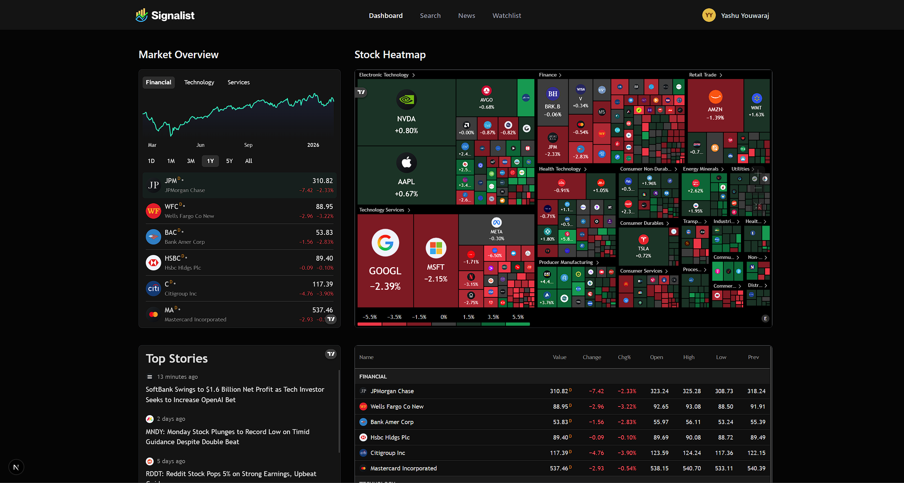
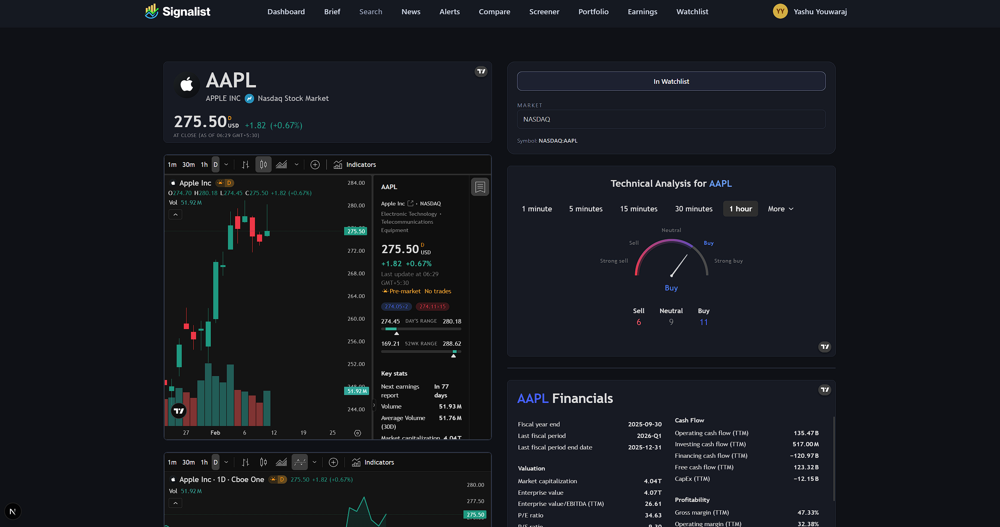
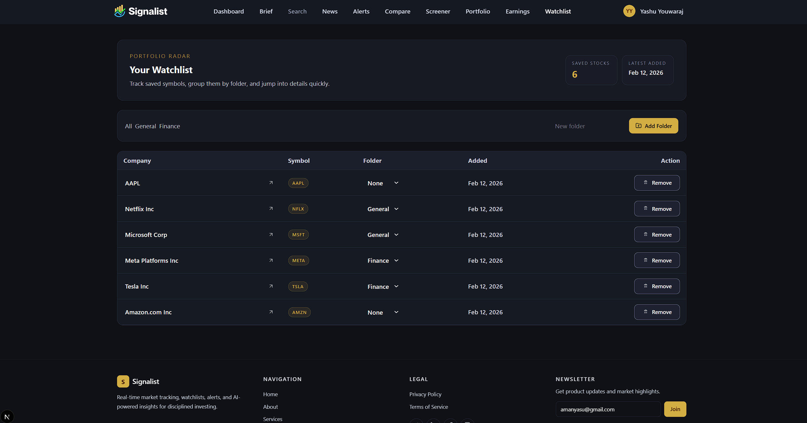
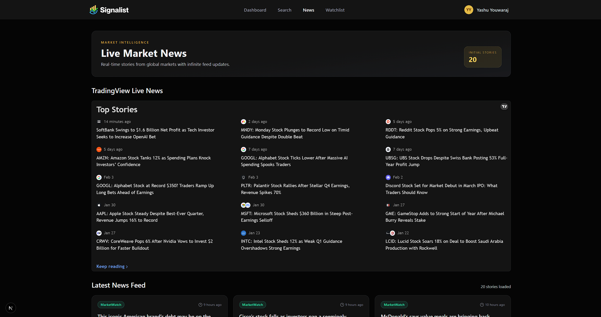
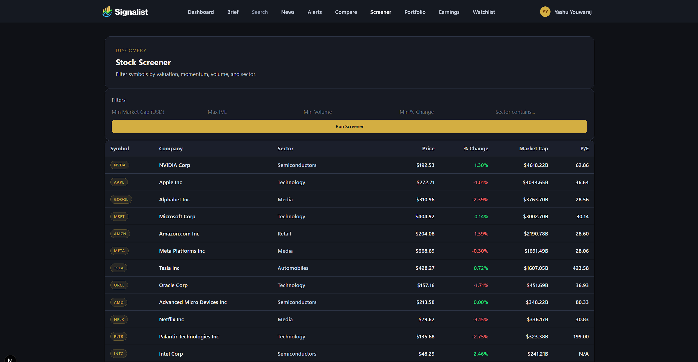
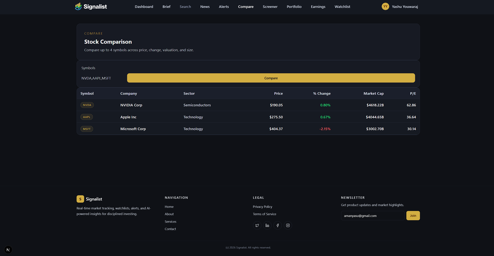
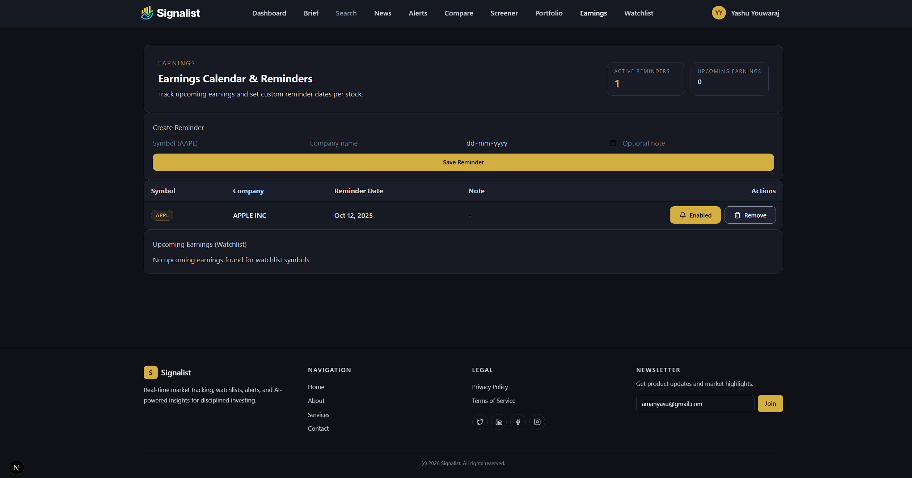
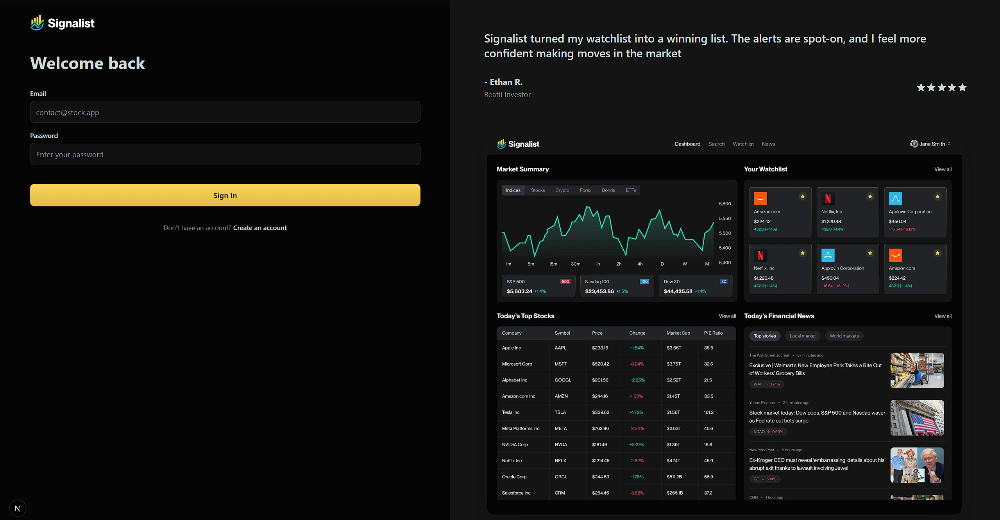
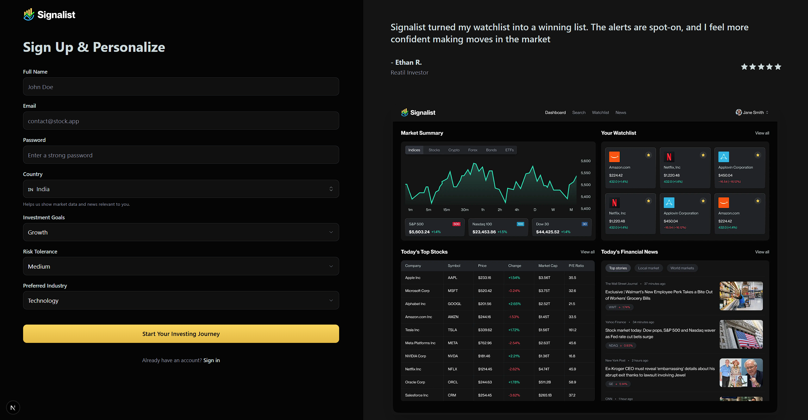

# Signalist

Signalist is a full-stack Next.js fintech application focused on practical market operations: discover symbols, monitor watchlists, screen opportunities, create alerts, track portfolio positions, follow market news, and receive AI-generated daily brief emails.


*Main dashboard with market widgets and regime context.*

---

## Overview

Signalist solves a common problem for retail/informed investors: market context and personal workflows are usually split across multiple tools.

This app brings them into one cohesive product:
- Live market context (TradingView widgets)
- Personalized workflows (watchlist, folders, alerts, portfolio, earnings reminders)
- Daily intelligence layer (AI brief + email automation)
- Professional dark UI built for high-density information scanning

---

## Key Features

### Market Dashboard & Charts
- Live TradingView widgets for overview, heatmap, market quotes, and top stories
- Dedicated stock details page with multiple chart/analysis widgets
- Market regime snapshot for quick risk context


*Stock details workspace with chart-focused analysis blocks.*

### Search + Watchlist Workflow
- Fast stock search with debounced queries
- One-click star/unstar watchlist actions
- Watchlist table with folder-based grouping
- Cross-page watchlist sync via custom browser event (`watchlist:updated`)


*Watchlist with folder organization and quick actions.*

### News Intelligence
- Infinite-scroll market news feed (`20` items per page)
- Relevance scoring based on watchlist symbol mentions + recency
- TradingView timeline integration for live headlines


*Infinite news feed with relevance ranking.*

### Portfolio, Alerts, Screener, Compare
- Portfolio tracker for position quantity and average cost
- Smart alert rules (price thresholds, % move, volume spike, gap alerts)
- Backtest-lite endpoint for 30-day alert hit-rate checks
- Stock screener filters (market cap, P/E, volume, change, sector)
- Multi-symbol comparison (up to 4 symbols)


*Portfolio position management and capital overview.*


*Rule-based alert engine with operational controls.*


*Filter-based screener for quick opportunity discovery.*


*Side-by-side stock comparison across key metrics.*

### Earnings & AI Digest
- Earnings reminders CRUD + upcoming earnings view for watchlist symbols
- AI Daily Brief generated through Inngest workflows and stored per user
- In-app brief page + email delivery


*Earnings reminders and watchlist earnings tracking.*

---

## Innovations & Engineering Highlights

- **Event-driven automation:** Inngest handles signup welcome flow, daily news summaries, and daily AI brief generation.
- **Secure email preference controls:** Signed unsubscribe tokens, backend verification, unauthenticated link support, and marketing-send gating.
- **Rate-limit-aware data access:** Finnhub calls include retry/backoff and controlled batching for screener workloads.
- **Operational UX sync:** Watchlist updates are reflected across active views without full page reloads.
- **Widget performance strategy:** TradingView widgets are lazy-mounted with `IntersectionObserver` to reduce initial page cost.

---

## UI/UX Approach

- TradingView-style professional dark theme (`#0f1116`, `#161a23`, `#1c2130`)
- High-contrast typography and muted secondary text for readability
- Dense but organized card/table layout for fast scanning
- Consistent interactions: subtle transitions, status colors, hover states
- Responsive behavior across desktop and mobile layouts

---

## Architecture Overview

Signalist uses a modular App Router architecture:

```txt
app/
  (auth)/                 # Sign-in / sign-up
  (root)/                 # Main authenticated product pages
  api/                    # Route handlers (alerts, news, screener, etc.)
  unsubscribe/            # Unsubscribe confirmation UI
  email-preferences/      # Email subscription preferences UI

components/               # Feature-first React components
lib/
  actions/                # Server-side domain logic (Finnhub, users, watchlist, briefs)
  better-auth/            # Auth initialization
  inngest/                # Workflows + prompts
  nodemailer/             # Mail transport + templates
  subscription.ts         # Subscription state utilities
  unsubscribe.ts          # Signed token utilities

database/
  mongoose.ts             # Connection caching
  models/                 # Domain schemas (watchlist, alerts, briefs, etc.)

hooks/                    # UI perf hooks (debounce, TradingView lazy mount)
public/stock-market-app-ss/
                          # README screenshots
```

---

## State Management Strategy

- **Server state:** App Router server components + route handlers + Mongoose models
- **Client state:** local component state (`useState`, `useMemo`, `useEffect`) per feature module
- **No global client store:** intentional feature-local state boundaries keep complexity low
- **Event-based synchronization:** selected flows (watchlist) propagate updates through custom events

---

## Performance & Optimization

- Debounced stock search to cut query burst traffic
- Lazy widget mounting with viewport detection
- News feed URL deduplication while paginating
- Batching + pacing for screener data fetches
- Retry/backoff on external API throttling (HTTP `429`)
- Shared MongoDB connection cache to avoid reconnect overhead

---

## Tech Stack

### Frontend
- Next.js 16 (App Router)
- React 19
- TypeScript
- Tailwind CSS v4
- shadcn/Radix UI primitives
- Lucide icons

### Backend & Data
- Next.js Route Handlers
- MongoDB + Mongoose
- Better Auth (email/password)

### Integrations
- Finnhub API (quotes, profiles, news, earnings, financial metrics)
- TradingView widgets (charting and market modules)
- Inngest (scheduled and event-driven jobs)
- Gemini API via Inngest AI interface (brief/news summarization)
- Nodemailer (transactional/marketing email workflows)

### Tooling
- ESLint
- Turbopack (Next.js 16)

---

## Installation & Setup

### 1. Clone and install

```bash
git clone <your-repo-url>
cd Real-Time-Stock-Market
npm install
```

### 2. Configure environment variables

Create `.env.local` in the project root:

```env
MONGODB_URI=

BETTER_AUTH_SECRET=
BETTER_AUTH_URL=http://localhost:3000

FINNHUB_API_KEY=
NEXT_PUBLIC_FINNHUB_API_KEY=

GEMINI_API_KEY=

NODEMAILER_EMAIL=
NODEMAILER_PASSWORD=

NEXT_PUBLIC_APP_URL=http://localhost:3000
# Optional
# UNSUBSCRIBE_SECRET=
```

### 3. Run locally

```bash
npm run dev
```

Open: `http://localhost:3000`

### 4. Build for production

```bash
npm run build
npm run start
```

---

## Available Scripts

```bash
npm run dev
npm run lint
npm run build
npm run start
```

---

## Future Improvements

- Unified design-system tokens across all feature modules
- Stronger API caching and pre-aggregation for heavy screens
- Expanded automated test coverage for critical user flows
- Enhanced analytics/observability for external API and job health

---

## Contribution

Contributions are welcome. Open an issue first for major changes, then submit a PR with:
- clear scope,
- reproducible test steps,
- and screenshots for UI changes.

---

## License

No license file is currently defined in this repository.
If open-source distribution is intended, add a license file (e.g., MIT).

---

## Authentication Screens


*Sign-in experience.*


*Sign-up flow with onboarding profile fields.*
